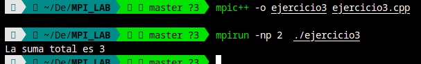

# EJERCICIOS MPI

---

**Alumna**: Luciana Julissa Huamán Coaquira

---

## Índice

- **3.1** 
- **3.2** 
- **3.3** 
- **3.4** 
- **3.7** 


---

# EJERCICIO 3.1: Cálculo de Histograma en Paralelo usando MPI

## Descripción del Problema

Este ejercicio aborda el cálculo de un histograma en paralelo utilizando la biblioteca **MPI (Message Passing Interface)**. Dado un conjunto de datos, el objetivo es distribuir estos datos entre varios procesos que calculan un histograma local (cantidad de elementos en cada categoría de un rango). Finalmente, los histogramas locales se combinan en un histograma global para obtener una visión completa de la distribución de datos. Este enfoque en paralelo permite un procesamiento más rápido y eficiente al dividir la carga de trabajo entre varios procesos.

## Código y Explicación por Fragmentos

### 1. Inclusión de Bibliotecas y Definición de Constantes

```cpp
- #include <mpi.h>
- #include <iostream>
- #include <vector>
- #define CANTIDAD_CATEGORIAS 5
```

- `#include <mpi.h>`: Incluye la biblioteca de MPI, que permite la comunicación entre procesos en paralelo.
- `#include <iostream>`: Biblioteca estándar de C++ para entrada y salida de datos.
- `#include <vector>`: Biblioteca estándar de C++ para el uso de vectores, que en este caso almacena los datos numéricos.
- `#define CANTIDAD_CATEGORIAS 5`: Define el número de categorías para el histograma. Esto permite clasificar los datos en cinco rangos.

### 2. Estructura `RangoCategorias`

```cpp
struct RangoCategorias {
    double limite_inferior;
    double limite_superior;
    double tamano_intervalo;
};
```

Esta estructura `RangoCategorias` define los parámetros que caracterizan cada categoría del histograma:
- `limite_inferior`: Límite inferior del rango de datos.
- `limite_superior`: Límite superior del rango.
- `tamano_intervalo`: Tamaño del intervalo de cada categoría, calculado automáticamente.

### 3. Función `inicializar_rangos`

```cpp
RangoCategorias inicializar_rangos(double limite_inferior, double limite_superior, int cantidad_categorias) {
    RangoCategorias rango;
    rango.limite_inferior = limite_inferior;
    rango.limite_superior = limite_superior;
    rango.tamano_intervalo = (limite_superior - limite_inferior) / cantidad_categorias;
    return rango;
}
```

**Descripción**: Esta función inicializa los rangos de las categorías en el histograma.
- **Parámetros**:
  - `limite_inferior` y `limite_superior`: Los límites del rango de datos.
  - `cantidad_categorias`: Número de categorías en el histograma.
- **Cálculo del Intervalo**: Calcula el tamaño de cada categoría dividiendo el rango total entre el número de categorías.
- **Retorno**: Devuelve una estructura `RangoCategorias` con estos valores, lista para clasificar datos.

### 4. Función `asignar_categoria`

```cpp
int asignar_categoria(double valor, const RangoCategorias& rango) {
    int indice_categoria = (int)((valor - rango.limite_inferior) / rango.tamano_intervalo);
    if (indice_categoria >= CANTIDAD_CATEGORIAS) {
        indice_categoria = CANTIDAD_CATEGORIAS - 1;
    }
    return indice_categoria;
}
```

**Descripción**: Esta función asigna un valor a una categoría específica en el histograma.
- **Parámetros**: 
  - `valor`: Dato a clasificar.
  - `rango`: Estructura `RangoCategorias` con los límites y tamaño de intervalos.
- **Cálculo de Categoría**: Calcula el índice de la categoría dividiendo la diferencia entre el valor y el límite inferior por el tamaño del intervalo.
- **Ajuste de Categoría**: Si el índice calculado es mayor o igual que el número de categorías (`CANTIDAD_CATEGORIAS`), se ajusta al último índice para evitar errores de rango.
- **Retorno**: Devuelve el índice de la categoría correspondiente.

### 5. Función `procesar_datos_locales`

```cpp
void procesar_datos_locales(const vector<double>& datos_locales, int* histograma_local, const RangoCategorias& rango) {
    for (double valor : datos_locales) {
        int categoria = asignar_categoria(valor, rango);
        histograma_local[categoria]++;
    }
}
```

**Descripción**: Esta función procesa los datos locales (asignados a cada proceso) y genera un histograma parcial.
- **Parámetros**:
  - `datos_locales`: Vector de datos que el proceso actual tiene asignado.
  - `histograma_local`: Array para almacenar la cuenta de datos en cada categoría.
  - `rango`: Estructura `RangoCategorias` que contiene la información de límites e intervalos.
- **Proceso**: 
  - Itera sobre cada valor en `datos_locales`, determina su categoría con `asignar_categoria`, y aumenta el contador de esa categoría en `histograma_local`.

### 6. Función `imprimir_histograma`

```cpp
void imprimir_histograma(const int* histograma_global) {
    cout << "Resultado del Histograma:" << endl;
    for (int i = 0; i < CANTIDAD_CATEGORIAS; i++) {
        cout << "Categoria " << i << ": " << histograma_global[i] << endl;
    }
}
```

**Descripción**: Imprime el histograma global final.
- **Parámetros**:
  - `histograma_global`: Array que contiene la cuenta total de cada categoría.
- **Proceso**: 
  - Itera sobre cada categoría y muestra la cantidad de elementos en cada una.

### 7. Función `main`

```cpp
int main(int argc, char* argv[]) {
    double conjunto_datos[] = {1.3, 2.9, 0.4, 0.3, 1.3, 4.4, 1.7, 0.4, 3.2, 0.3, 4.9, 2.4, 3.1, 4.4, 3.9, 0.4, 4.2, 4.5, 4.9, 0.9};
    int cantidad_datos = 20;
    int histograma_local[CANTIDAD_CATEGORIAS] = {0};
    int histograma_global[CANTIDAD_CATEGORIAS] = {0};

    MPI_Init(&argc, &argv);
    int tamano_mundo, rango_mundo;
    MPI_Comm_size(MPI_COMM_WORLD, &tamano_mundo);
    MPI_Comm_rank(MPI_COMM_WORLD, &rango_mundo);

    RangoCategorias rango = inicializar_rangos(0.0, 5.0, CANTIDAD_CATEGORIAS);

    int cantidad_datos_local = cantidad_datos / tamano_mundo;
    vector<double> datos_locales(conjunto_datos + rango_mundo * cantidad_datos_local,
                                 conjunto_datos + (rango_mundo + 1) * cantidad_datos_local);

    procesar_datos_locales(datos_locales, histograma_local, rango);

    MPI_Reduce(histograma_local, histograma_global, CANTIDAD_CATEGORIAS, MPI_INT, MPI_SUM, 0, MPI_COMM_WORLD);

    if (rango_mundo == 0) {
        imprimir_histograma(histograma_global);
    }

    MPI_Finalize();
    return 0;
}
```

**Explicación**:

1. **Inicialización**:
   - `MPI_Init`: Inicializa el entorno MPI.
   - `MPI_Comm_size` y `MPI_Comm_rank`: Determinan el tamaño total de procesos (`tamano_mundo`) y el rango o identificador del proceso actual (`rango_mundo`).

2. **Datos y Parámetros**:
   - `conjunto_datos`: Array de datos a procesar (20 elementos).
   - `cantidad_datos`: Número total de datos.
   - `histograma_local` y `histograma_global`: Arrays para almacenar los resultados locales y globales del histograma.

3. **Inicialización de Rangos**:
   - `inicializar_rangos(0.0, 5.0, CANTIDAD_CATEGORIAS)`: Configura el rango para el histograma entre 0 y 5, con cinco categorías.

4. **Distribución de Datos**:
   - Cada proceso obtiene una porción del `conjunto_datos` según su identificador `rango_mundo`.

5. **Cálculo del Histograma Local**:
   - `procesar_datos_locales` genera el histograma parcial para los datos asignados al proceso actual.

6. **Reducción de Resultados**:
   - `MPI_Reduce`: Combina todos los `histograma_local` en el `histograma_global` en el proceso raíz.

7. **Impresión del Histograma Global**:
   - Si `rango_mundo` es 0, se llama a `imprimir_histograma` para mostrar el resultado final.

8. **Finalización**:
   - `MPI_Finalize`: Cierra el entorno MPI.


9. **Resultados**:


---


# EJERCICIO 3.2: Estimación de Pi en Paralelo usando MPI

## Descripción del Problema

Este código utiliza el método de **Monte Carlo** para estimar el valor de Pi en un entorno de procesamiento paralelo mediante **MPI (Message Passing Interface)**. El método de Monte Carlo calcula Pi generando puntos aleatorios dentro de un cuadrado de lado 2 y contando cuántos de esos puntos caen dentro de un círculo inscrito en el cuadrado. El cálculo se paraleliza distribuyendo los "tiros" entre diferentes procesos y combinando los resultados en un proceso raíz.

## Código y Explicación por Fragmentos

### Inclusión de Bibliotecas

```cpp
- #include <mpi.h>
- #include <iostream>
- #include <cstdlib>
- #include <ctime>
```

- `#include <mpi.h>`: Incluye la biblioteca MPI para permitir la comunicación entre procesos en paralelo.
- `#include <iostream>`: Biblioteca estándar de C++ para entrada y salida de datos.
- `#include <cstdlib>` y `#include <ctime>`: Para generación de números aleatorios. `cstdlib` se utiliza para la función `rand_r`, y `ctime` para inicializar la semilla.

### Función Principal `main`

```cpp
int main (int argc, char* argv[])
{
    int rank, size;
    long long int local_tiros_circulo = 0, global_tiros_circulo = 0, tirosPerProceso, totalTiros;

    MPI_Init (&argc, &argv);
    MPI_Comm_rank (MPI_COMM_WORLD, &rank);
    MPI_Comm_size (MPI_COMM_WORLD, &size);
```

**Descripción**: Inicializa el entorno MPI y configura las variables necesarias para la estimación de Pi.
- `rank` y `size`: `rank` identifica el número del proceso actual y `size` el número total de procesos.
- `local_tiros_circulo` y `global_tiros_circulo`: Variables para contar los puntos dentro del círculo localmente en cada proceso y globalmente en todos los procesos.
- `tirosPerProceso` y `totalTiros`: `tirosPerProceso` representa el número de tiros por proceso, y `totalTiros` el número total de tiros en todos los procesos.
- `MPI_Init`: Inicializa el entorno de MPI.
- `MPI_Comm_rank` y `MPI_Comm_size`: Determinan el `rank` del proceso actual y el `size` total de procesos en el comunicador `MPI_COMM_WORLD`.

### Entrada de Datos y Distribución de Trabajo

```cpp
    if (rank == 0)
    {
        cin >> totalTiros;
    }
    MPI_Bcast (&totalTiros, 1, MPI_LONG_LONG_INT, 0, MPI_COMM_WORLD);
    tirosPerProceso = totalTiros / size;
```

**Descripción**: El proceso raíz (`rank == 0`) obtiene el número total de tiros (`totalTiros`) del usuario y lo distribuye a todos los procesos.
- `MPI_Bcast`: Envía el valor de `totalTiros` desde el proceso raíz a todos los demás procesos.
- `tirosPerProceso`: Calcula el número de tiros que cada proceso debe realizar dividiendo `totalTiros` entre `size`.

### Generación de Puntos Aleatorios y Cálculo Local de Puntos dentro del Círculo

```cpp
    unsigned int seed = time(0) + rank;

    for (long long int tiros = 0; tiros < tirosPerProceso; tiros++)
    {
        double x = (rand_r(&seed) / (double)RAND_MAX) * 2.0 - 1.0;
        double y = (rand_r(&seed) / (double)RAND_MAX) * 2.0 - 1.0;
        double distCuadrado = x * x + y * y;
        if (distCuadrado <= 1)
        {
            local_tiros_circulo++;
        }
    }
```

**Descripción**: Cada proceso genera puntos aleatorios dentro de un cuadrado de lado 2 y cuenta cuántos puntos caen dentro del círculo inscrito.
- `seed`: Cada proceso utiliza una semilla distinta (`time(0) + rank`) para asegurar que los números aleatorios no se repitan entre procesos.
- Bucle `for`: Genera `tirosPerProceso` puntos aleatorios.
  - `x` y `y`: Coordenadas de un punto aleatorio dentro del cuadrado, escaladas a un rango de -1 a 1.
  - `distCuadrado`: Calcula la distancia al cuadrado del punto al origen `(0,0)`. Si `distCuadrado` es menor o igual a 1, el punto está dentro del círculo y `local_tiros_circulo` se incrementa.

### Reducción y Cálculo Final de Pi

```cpp
    MPI_Reduce(&local_tiros_circulo, &global_tiros_circulo, 1, MPI_LONG_LONG_INT, MPI_SUM, 0, MPI_COMM_WORLD);
```

**Descripción**: Combina los resultados locales de cada proceso en un resultado global.
- `MPI_Reduce`: Suma todos los valores de `local_tiros_circulo` de cada proceso y almacena el total en `global_tiros_circulo` en el proceso raíz.

### Cálculo e Impresión del Valor Estimado de Pi

```cpp
    if(rank == 0)
    {
        double pi = 4.0 * global_tiros_circulo / ((double) totalTiros);
        cout <<"El Pi estimado es " << pi << endl;
    }
```

**Descripción**: Solo el proceso raíz calcula e imprime el valor estimado de Pi.
- `pi = 4.0 * global_tiros_circulo / ((double) totalTiros)`: Calcula el valor de Pi usando la fórmula de Monte Carlo. El factor `4.0` es necesario porque estamos calculando Pi en un cuarto de círculo dentro de un cuadrado.
- `cout`: Imprime el valor estimado de Pi.

### Finalización de MPI

```cpp
    MPI_Finalize();
    return 0;
}
```

**Descripción**: Finaliza el entorno MPI, liberando los recursos asociados.

---

## Explicación Completa del Método Monte Carlo para Estimar Pi

El método Monte Carlo para calcular Pi genera puntos aleatorios en un cuadrado de lado 2, centrado en el origen, y mide cuántos de esos puntos caen dentro del círculo de radio 1 inscrito en dicho cuadrado. La proporción de puntos dentro del círculo respecto al total de puntos generados se relaciona con Pi, dado que el área del círculo es π*r² (con r=1, el área es Pi) y el área del cuadrado es 4. La fórmula para estimar Pi es:

\[
\text{Pi estimado} = 4 \times \left(\frac{\text{Puntos en el círculo}}{\text{Puntos totales}}\right)
\]

Cada proceso en paralelo genera puntos de forma independiente, cuenta cuántos caen dentro del círculo y luego se suman los resultados en un proceso raíz para calcular Pi.

## Ejecución


---

# EJERCICIO 3.3: Suma en Paralelo usando un Árbol Binario en MPI

## Descripción del Problema

Este código utiliza **MPI (Message Passing Interface)** para realizar la suma de valores distribuidos entre diferentes procesos de forma paralela. La suma se realiza siguiendo un esquema de comunicación en forma de árbol binario, donde cada proceso suma su valor local con el de otros procesos, reduciendo el total en cada paso hasta obtener el resultado final en el proceso raíz (`rango = 0`). Este enfoque es eficiente para operaciones de reducción en paralelo.

## Código y Explicación 

### Inclusión de Bibliotecas

```cpp
- #include <mpi.h>
- #include <iostream>
using namespace std;
```

- `#include <mpi.h>`: Incluye la biblioteca MPI, necesaria para ejecutar funciones de procesamiento paralelo.
- `#include <iostream>`: Biblioteca estándar de C++ para manejo de entrada y salida de datos.
- `using namespace std;`: Permite el uso directo de los elementos del espacio de nombres `std`, como `cout` y `endl`.

### Función Principal `main`

```cpp
int main(int argc, char* argv[])
{
    int rango, tam_comunicador, valor_local, suma_global = 0;
    MPI_Init(&argc, &argv);
    MPI_Comm_rank(MPI_COMM_WORLD, &rango);
    MPI_Comm_size(MPI_COMM_WORLD, &tam_comunicador);
```

**Descripción**: Inicializa el entorno MPI y configura las variables necesarias.
- `rango`: Identificador único de cada proceso en el comunicador.
- `tam_comunicador`: Número total de procesos que participan en el comunicador.
- `valor_local`: Valor inicial de cada proceso, que será su `rango + 1`.
- `suma_global`: Variable para almacenar el resultado de la suma (utilizada solo en el proceso raíz).
- `MPI_Init`: Inicializa el entorno de MPI.
- `MPI_Comm_rank` y `MPI_Comm_size`: Determinan el `rango` del proceso actual y el `tam_comunicador` total de procesos.

### Asignación de Valor Local

```cpp
    // Asigna un valor local inicial a cada proceso (rango + 1)
    valor_local = rango + 1;
```

**Descripción**: Asigna a cada proceso un valor inicial basado en su `rango` (identificador). Este valor es `rango + 1`, lo que significa que el proceso con `rango = 0` tendrá `valor_local = 1`, el proceso con `rango = 1` tendrá `valor_local = 2`, y así sucesivamente.

### Suma en Árbol Binario

```cpp
    int paso = 1;
    while (paso < tam_comunicador)
    {
        if (rango % (2 * paso) == 0) {
            int valor_recibido;
            MPI_Recv(&valor_recibido, 1, MPI_INT, rango + paso, 0, MPI_COMM_WORLD, MPI_STATUS_IGNORE);
            valor_local += valor_recibido;
        } else if (rango % paso == 0) {
            MPI_Send(&valor_local, 1, MPI_INT, rango - paso, 0, MPI_COMM_WORLD);
            break;
        }
        paso *= 2;
    }
```

**Descripción**: Este bloque realiza la suma en paralelo utilizando un patrón de árbol binario. En cada iteración, un proceso recibe el valor de otro proceso, lo suma a su `valor_local` y envía el resultado en el siguiente paso si corresponde. Esta técnica reduce el número de operaciones necesarias para obtener la suma total.

- `paso`: Controla el tamaño de los saltos entre procesos en cada nivel del árbol binario. Comienza en 1 y se duplica en cada iteración.
- `if (rango % (2 * paso) == 0)`: Este proceso es responsable de recibir el valor de otro proceso. Calcula la suma acumulada de su `valor_local` con el `valor_recibido`.
  - `MPI_Recv`: Recibe un valor del proceso en `rango + paso`.
- `else if (rango % paso == 0)`: Este proceso envía su valor y sale del bucle.
  - `MPI_Send`: Envía su `valor_local` al proceso `rango - paso`.
- `paso *= 2;`: Duplica el valor de `paso`, reduciendo el número de procesos activos en el cálculo de la suma en cada iteración.

### Impresión del Resultado Final

```cpp
    if (rango == 0)
    {
        cout << "La suma total es " << valor_local << endl;
    }
```

**Descripción**: Solo el proceso raíz (`rango = 0`) imprime el resultado final de la suma.
- `cout`: Muestra en la consola el resultado de la suma total de los valores `valor_local` de todos los procesos.

### Finalización de MPI

```cpp
    MPI_Finalize();
    return 0;
}
```

**Descripción**: Cierra el entorno MPI y finaliza el programa.
- `MPI_Finalize`: Libera los recursos de MPI.

---

## Explicación del Algoritmo en Forma de Árbol Binario

El algoritmo de reducción en forma de árbol binario es eficiente para sumar valores distribuidos en múltiples procesos. La idea es dividir la operación en etapas, en las cuales se van combinando valores en procesos pares e impares hasta que solo un proceso (el proceso raíz) tiene el valor total.

En cada etapa:
- Los procesos con `rango` par reciben valores de sus procesos vecinos con `rango` impar.
- Luego, los procesos pares continúan en la siguiente etapa, mientras que los procesos impares quedan excluidos.
- Este patrón de reducción en forma de árbol minimiza el número de mensajes enviados, haciendo que la operación sea más eficiente en sistemas de procesamiento paralelo.

## Ejecución




---

Aquí tienes el informe en formato Markdown con una explicación detallada del código.

---

```
# EJERCICIO 3.4: Suma en Paralelo mediante Árbol Binario en MPI

## Descripción del Problema

Este programa en C++ utiliza **MPI (Message Passing Interface)** para realizar la suma de valores distribuidos en diferentes procesos de forma paralela. Cada proceso tiene un valor local y se sigue una estructura de árbol binario para sumar estos valores. Al final del proceso, el resultado de la suma global se encuentra en el proceso raíz (`rango = 0`). Este método es eficiente para realizar reducciones en paralelo al minimizar el número de comunicaciones necesarias.

## Código y Explicación por Fragmentos

### Inclusión de Bibliotecas

```cpp
- #include <mpi.h>
- #include <iostream>
using namespace std;
```

- `#include <mpi.h>`: Incluye la biblioteca MPI, que permite la comunicación entre procesos en paralelo.
- `#include <iostream>`: Biblioteca estándar de C++ para entrada y salida de datos.
- `using namespace std;`: Permite el uso directo de los elementos del espacio de nombres `std`, como `cout` y `endl`.

### Función Principal `main`

```cpp
int main(int argc, char* argv[])
{
    int rango, tamanoComunicador, valorLocal, sumaGlobal = 0;

    MPI_Init(&argc, &argv);
    MPI_Comm_rank(MPI_COMM_WORLD, &rango);
    MPI_Comm_size(MPI_COMM_WORLD, &tamanoComunicador);
```

**Descripción**: Inicializa el entorno MPI y define variables necesarias para realizar la suma.
- `rango`: Identificador único de cada proceso en el comunicador.
- `tamanoComunicador`: Número total de procesos en el comunicador.
- `valorLocal`: Valor inicial de cada proceso, calculado como `rango + 1`.
- `sumaGlobal`: Variable que almacenará el resultado de la suma (se usa solo en el proceso raíz).
- `MPI_Init`: Inicializa el entorno MPI.
- `MPI_Comm_rank` y `MPI_Comm_size`: Determinan el `rango` del proceso actual y el `tamanoComunicador`.

### Asignación de Valor Local

```cpp
    valorLocal = rango + 1;
```

**Descripción**: Asigna a cada proceso un valor inicial basado en su `rango`. Esto significa que el proceso 0 tendrá `valorLocal = 1`, el proceso 1 tendrá `valorLocal = 2`, y así sucesivamente. Este valor será el que cada proceso contribuirá a la suma global.

### Suma en Árbol Binario

```cpp
    int paso = 1;

    while (paso < tamanoComunicador)
    {
        if (rango % (2 * paso) == 0 )
        {
            int emisor = rango + paso;
            if (emisor < tamanoComunicador)
            {
                int valorRecibido;
                MPI_Recv(&valorRecibido, 1, MPI_INT, emisor, 0, MPI_COMM_WORLD, MPI_STATUS_IGNORE);
                valorLocal += valorRecibido;
            }
        } 
        else if ((rango - paso) % (2 * paso) == 0)
        {
            int receptor = rango - paso;
            MPI_Send(&valorLocal, 1, MPI_INT, receptor, 0, MPI_COMM_WORLD);
            break;
        }
        paso *= 2;
    }
```

**Descripción**: Realiza la suma en paralelo usando un esquema de árbol binario. En cada iteración, ciertos procesos envían su `valorLocal` a otros procesos, mientras que otros reciben y acumulan estos valores. Este enfoque reduce la cantidad de comunicaciones y hace que la suma sea más eficiente.

- `paso`: Controla el tamaño de los saltos entre procesos en cada iteración del árbol. Comienza en 1 y se duplica en cada iteración.
- **Recepción de Datos**:
  - `if (rango % (2 * paso) == 0)`: Este proceso actúa como receptor en esta iteración del árbol.
  - `int emisor = rango + paso;`: Determina el rango del proceso que enviará su valor.
  - `if (emisor < tamanoComunicador)`: Asegura que el emisor esté dentro del rango de procesos válidos.
  - `MPI_Recv`: Recibe el valor del proceso `emisor` y lo suma a `valorLocal`.
- **Envío de Datos**:
  - `else if ((rango - paso) % (2 * paso) == 0)`: Este proceso actúa como emisor y envía su valor.
  - `int receptor = rango - paso;`: Determina el rango del proceso que recibirá el valor.
  - `MPI_Send`: Envía `valorLocal` al proceso `receptor`.
  - `break;`: Sale del bucle una vez que el proceso ha enviado su valor.
- `paso *= 2;`: Duplica el valor de `paso`, disminuyendo la cantidad de procesos activos en cada iteración del árbol.

### Impresión del Resultado Final

```cpp
    if (rango == 0)
    {
        cout << "La suma total es " << valorLocal << endl;
    }
```

**Descripción**: Solo el proceso raíz (`rango = 0`) imprime el resultado final de la suma total.
- `cout`: Muestra en consola el resultado acumulado de la suma de todos los valores `valorLocal`.

### Finalización de MPI

```cpp
    MPI_Finalize();
    return 0;
}
```

**Descripción**: Finaliza el entorno MPI y libera los recursos utilizados en la comunicación.
- `MPI_Finalize`: Cierra el entorno MPI y libera los recursos.

---

## Explicación del Algoritmo en Árbol Binario

Este algoritmo utiliza un esquema en forma de árbol binario para sumar los valores de cada proceso en paralelo. En cada paso:
1. Los procesos "receptores" (pares) reciben el valor de los procesos "emisores" (impares).
2. Los procesos emisores envían sus valores y dejan de participar en la siguiente iteración.
3. Este proceso se repite hasta que solo queda un proceso (el proceso raíz), que contiene la suma total de los valores de todos los procesos.

Este esquema reduce el tiempo de comunicación al minimizar la cantidad de mensajes enviados, mejorando la eficiencia en entornos de cómputo paralelo.

## Ejecución


---

# EJERCICIO 3.4.1: Suma Global en Paralelo usando Operación XOR en MPI

## Descripción del Problema

Este programa en C++ utiliza **MPI (Message Passing Interface)** para calcular la suma global de valores distribuidos en distintos procesos, en paralelo. Utiliza una operación de bitwise XOR (`^`) para seleccionar los compañeros de comunicación en cada paso, logrando así una estructura de árbol hipercubo. Cada proceso suma su valor local con el de su "compañero" en cada paso hasta que todos los valores se acumulan en cada proceso. Al final, cada proceso tiene el mismo valor de la suma total.

## Código y Explicación por Fragmentos

### Inclusión de Bibliotecas

```cpp
- #include <mpi.h>
- #include <iostream>
using namespace std;
```

- `#include <mpi.h>`: Incluye la biblioteca MPI, que permite la comunicación entre procesos en paralelo.
- `#include <iostream>`: Biblioteca estándar de C++ para entrada y salida de datos.
- `using namespace std;`: Permite el uso directo de los elementos del espacio de nombres `std`, como `cout` y `endl`.

### Función Principal `main`

```cpp
int main(int argc, char* argv[]) {
    int rango, tamano_comunicador, valor_local, suma_global;

    MPI_Init(&argc, &argv);
    MPI_Comm_rank(MPI_COMM_WORLD, &rango);          
    MPI_Comm_size(MPI_COMM_WORLD, &tamano_comunicador); 
```

**Descripción**: Inicializa el entorno MPI y define variables para el cálculo de la suma.
- `rango`: Identificador único de cada proceso dentro del comunicador.
- `tamano_comunicador`: Número total de procesos en el comunicador.
- `valor_local`: Valor inicial en cada proceso, que será `rango + 1`.
- `suma_global`: Aunque no se usa explícitamente en el código, representa el concepto de la suma acumulada que cada proceso obtiene al final.
- `MPI_Init`: Inicializa el entorno de MPI.
- `MPI_Comm_rank` y `MPI_Comm_size`: Determinan el `rango` del proceso actual y el `tamano_comunicador` total de procesos.

### Asignación de Valor Local

```cpp
    valor_local = rango + 1;
```

**Descripción**: Asigna a cada proceso un valor inicial basado en su `rango`. Esto significa que el proceso con `rango = 0` tendrá `valor_local = 1`, el proceso con `rango = 1` tendrá `valor_local = 2`, y así sucesivamente. Estos valores se acumularán en cada proceso al final del cálculo.

### Cálculo de la Suma usando Compañeros basados en XOR

```cpp
    int desplazamiento = 1;

    while (desplazamiento < tamano_comunicador) {
        int companero = rango ^ desplazamiento;

        int valor_recibido;
        MPI_Sendrecv(&valor_local, 1, MPI_INT, companero, 0, &valor_recibido, 1, MPI_INT, companero, 0, MPI_COMM_WORLD, MPI_STATUS_IGNORE);

        valor_local += valor_recibido;

        desplazamiento *= 2;
    }
```

**Descripción**: Este bloque realiza la suma en paralelo mediante un esquema de árbol hipercubo, donde cada proceso intercambia información con otro proceso determinado mediante una operación XOR en cada paso. Este enfoque permite que todos los procesos acumulen la suma total al final.

- `desplazamiento`: Controla el desplazamiento de los bits para la operación XOR, comenzando en 1 y duplicándose en cada iteración.
- `companero = rango ^ desplazamiento;`: Calcula el "compañero" de comunicación para el proceso actual usando una operación XOR. La operación XOR asegura que cada proceso intercambie datos con un compañero único en cada iteración, formando una estructura de árbol hipercubo.
- `MPI_Sendrecv`: Realiza una comunicación de envío y recepción simultánea entre procesos. Cada proceso envía su `valor_local` al `companero` y recibe el `valor_recibido` de ese compañero.
  - `&valor_local`: Dato que el proceso envía.
  - `companero`: Proceso de destino del mensaje.
  - `&valor_recibido`: Variable donde el proceso recibe el valor del `companero`.
- `valor_local += valor_recibido;`: Suma el valor recibido del compañero al valor local.
- `desplazamiento *= 2;`: Duplica el valor de `desplazamiento` en cada iteración para cambiar el compañero de comunicación en el siguiente paso.

### Impresión del Resultado en Cada Proceso

```cpp
    cout << "Proceso " << rango << " - Suma global: " << valor_local << endl;
```

**Descripción**: Al final del cálculo, cada proceso tiene el mismo valor en `valor_local`, que representa la suma global de todos los valores iniciales de cada proceso. Cada proceso imprime este valor.
- `cout`: Imprime el `rango` del proceso y el resultado de la suma total.

### Finalización de MPI

```cpp
    MPI_Finalize();
    return 0;
}
```

**Descripción**: Finaliza el entorno MPI y libera los recursos utilizados en la comunicación.
- `MPI_Finalize`: Cierra el entorno MPI y libera los recursos.

---

## Explicación del Algoritmo usando XOR para Compañeros

Este algoritmo emplea una estructura de árbol hipercubo para calcular la suma en paralelo. La clave de este algoritmo es la operación XOR (`^`), que permite a cada proceso determinar su "compañero" de comunicación en cada paso. La operación XOR asegura que cada proceso se comunique con un compañero único en cada iteración, logrando así una comunicación eficiente.

### Resumen del Flujo

1. **Desplazamiento Dinámico**: El `desplazamiento` se duplica en cada paso, cambiando los compañeros de comunicación en cada iteración.
2. **Intercambio de Valores**: Cada proceso envía su valor actual y recibe el valor de su compañero.
3. **Acumulación**: Los valores recibidos se suman a `valor_local`, permitiendo que todos los procesos obtengan la suma total al final.

##  Ejecución


---


# EJERCICIO 3.4.2: Cálculo de la Suma Global en Paralelo mediante Comunicación con Operación XOR en MPI

## Descripción del Problema

Este programa en C++ usa **MPI (Message Passing Interface)** para calcular la suma global de valores distribuidos en distintos procesos de manera paralela. Para realizar esta suma, cada proceso se comunica con un "compañero" determinado mediante una operación XOR en cada iteración, lo cual forma una estructura en árbol hipercubo. Esta técnica permite que cada proceso acumule la suma total en paralelo y almacene el resultado global de la suma en cada proceso al final.

## Código y Explicación por Fragmentos

### Inclusión de Bibliotecas

```cpp
- #include <mpi.h>
- #include <iostream>
using namespace std;
```

- `#include <mpi.h>`: Incluye la biblioteca MPI, que permite la comunicación entre procesos en paralelo.
- `#include <iostream>`: Biblioteca estándar de C++ para entrada y salida de datos.
- `using namespace std;`: Permite el uso directo de los elementos del espacio de nombres `std`, como `cout` y `endl`.

### Función Principal `main`

```cpp
int main(int argc, char* argv[]) {
    int rank, comm_sz, valorLocal, sumaGlobal;

    MPI_Init(&argc, &argv);
    MPI_Comm_rank(MPI_COMM_WORLD, &rank);
    MPI_Comm_size(MPI_COMM_WORLD, &comm_sz);
```

**Descripción**: Inicializa el entorno MPI y define las variables necesarias para el cálculo en paralelo de la suma.
- `rank`: Identificador único de cada proceso en el comunicador.
- `comm_sz`: Tamaño del comunicador, que representa el número total de procesos.
- `valorLocal`: Valor inicial de cada proceso, basado en su `rank`.
- `sumaGlobal`: Variable conceptual que representa la suma acumulada en cada proceso al finalizar el cálculo.
- `MPI_Init`: Inicializa el entorno de MPI.
- `MPI_Comm_rank` y `MPI_Comm_size`: Determinan el `rank` del proceso actual y el tamaño `comm_sz` del comunicador.

### Asignación de Valor Local

```cpp
    valorLocal = rank + 1;
```

**Descripción**: Asigna a cada proceso un valor inicial basado en su `rank`. Esto significa que el proceso con `rank = 0` tendrá `valorLocal = 1`, el proceso con `rank = 1` tendrá `valorLocal = 2`, y así sucesivamente. Estos valores se sumarán entre sí en cada iteración hasta obtener la suma total.

### Cálculo de la Suma utilizando Compañeros basados en XOR

```cpp
    int offset = 1;

    while (offset < comm_sz) {
        int compañero = rank ^ offset;
        if (compañero < comm_sz) {
            int valorRecibido;
            MPI_Sendrecv(&valorLocal, 1, MPI_INT, compañero, 0, &valorRecibido, 1, MPI_INT, compañero, 0, MPI_COMM_WORLD, MPI_STATUS_IGNORE);
            valorLocal += valorRecibido;
        }

        offset *= 2;
    }
```

**Descripción**: Este bloque de código implementa el cálculo de la suma global usando una comunicación en pares, en la cual cada proceso utiliza una operación XOR para identificar su compañero de comunicación en cada iteración. Este método optimiza la acumulación de la suma global en cada proceso.

- `offset`: Controla el desplazamiento en bits usado para calcular los compañeros de cada proceso mediante la operación XOR. Comienza en 1 y se duplica en cada iteración.
- `compañero = rank ^ offset;`: Calcula el "compañero" de comunicación del proceso actual mediante una operación XOR. La operación XOR asegura que los pares de comunicación cambien en cada iteración, formando una estructura en árbol hipercubo.
- **Condicional**: `if (compañero < comm_sz)` asegura que el compañero de comunicación esté dentro del rango válido de procesos.
- `MPI_Sendrecv`: Realiza la comunicación de envío y recepción simultánea entre procesos:
  - `&valorLocal`: Dato que el proceso actual envía.
  - `compañero`: Proceso al cual se envía el dato y del cual se recibe otro valor.
  - `&valorRecibido`: Variable donde el proceso actual almacena el valor recibido del compañero.
- `valorLocal += valorRecibido;`: Suma el valor recibido del compañero al `valorLocal` del proceso actual, acumulando progresivamente la suma total.
- `offset *= 2;`: Duplica el valor de `offset` en cada iteración para cambiar el compañero de comunicación en el siguiente paso.

### Impresión del Resultado en Cada Proceso

```cpp
    cout << "Proceso " << rank << " - Suma global: " << valorLocal << endl;
```

**Descripción**: Al final del cálculo, cada proceso posee el mismo valor acumulado en `valorLocal`, que representa la suma global de todos los valores iniciales de los procesos. Cada proceso imprime este valor.
- `cout`: Imprime el `rank` del proceso y el resultado de la suma total.

### Finalización de MPI

```cpp
    MPI_Finalize();
    return 0;
}
```

**Descripción**: Finaliza el entorno MPI y libera los recursos de comunicación utilizados.
- `MPI_Finalize`: Cierra el entorno MPI, liberando los recursos.

---

## Explicación del Algoritmo usando XOR para Comunicación en Árbol Hipercubo

Este algoritmo emplea una estructura en forma de árbol hipercubo para calcular la suma en paralelo. En cada paso:
1. **Desplazamiento XOR**: `offset` se duplica en cada iteración, de modo que cada proceso se comunique con un compañero único en cada paso, utilizando la operación XOR para alternar los compañeros de comunicación.
2. **Intercambio de Valores**: Cada proceso envía su valor y recibe el valor de su compañero.
3. **Acumulación**: Los valores recibidos se suman a `valorLocal`, acumulando la suma total en cada proceso.

### Ejecución


---


# EJERCICIO 3.7: Medición del Tiempo de Comunicación en un Programa Ping-Pong usando MPI

## Descripción del Problema

Este programa en C++ utiliza **MPI (Message Passing Interface)** para implementar un patrón de comunicación "ping-pong" entre dos procesos. El objetivo es medir el tiempo necesario para completar una cantidad específica de intercambios de mensajes entre los procesos, utilizando dos métodos de medición de tiempo: `clock()` de C++ y `MPI_Wtime()` de MPI. Este enfoque es útil para evaluar el rendimiento y la latencia en comunicaciones punto a punto en entornos paralelos.

## Código y Explicación por Fragmentos

### Inclusión de Bibliotecas

```cpp
- #include <mpi.h>
- #include <iostream>
- #include <ctime>
using namespace std;
```

- `#include <mpi.h>`: Incluye la biblioteca MPI para comunicación entre procesos en paralelo.
- `#include <iostream>`: Biblioteca estándar de C++ para entrada y salida de datos.
- `#include <ctime>`: Proporciona funciones de medición de tiempo como `clock()` para calcular el tiempo de ejecución en el sistema.
- `using namespace std;`: Permite el uso directo de elementos del espacio de nombres `std`, como `cout` y `cerr`.

### Función Principal `main`

```cpp
int main(int argc, char* argv[]) {
    int rango, tamano_comunicador;
    const int LIMITE_PING_PONG = 10000;
    int contador_ping_pong = 0;
    int mensaje = 0;

    MPI_Init(&argc, &argv);
    MPI_Comm_rank(MPI_COMM_WORLD, &rango);
    MPI_Comm_size(MPI_COMM_WORLD, &tamano_comunicador);
```

**Descripción**: Inicializa el entorno MPI y define variables necesarias para realizar la comunicación ping-pong.
- `rango`: Identificador único de cada proceso.
- `tamano_comunicador`: Número total de procesos.
- `LIMITE_PING_PONG`: Número de veces que los procesos intercambiarán mensajes. Se establece en 10,000 para medir el rendimiento.
- `contador_ping_pong`: Contador de intercambios realizados.
- `mensaje`: Variable utilizada para enviar y recibir datos en cada intercambio.
- `MPI_Init`: Inicializa el entorno de MPI.
- `MPI_Comm_rank` y `MPI_Comm_size`: Determinan el `rango` del proceso actual y el tamaño `tamano_comunicador` del comunicador.

### Verificación del Número de Procesos

```cpp
    if (tamano_comunicador != 2) {
        if (rango == 0) {
            cerr << "Este programa requiere exactamente 2 procesos." << endl;
        }
        MPI_Finalize();
        return 1;
    }
```

**Descripción**: Asegura que el programa se ejecute solo con dos procesos.
- **Condicional**: Si `tamano_comunicador` no es igual a 2, el proceso 0 muestra un mensaje de error y el programa termina.
- `cerr`: Muestra el mensaje de error en la salida estándar de errores.
- `MPI_Finalize`: Finaliza el entorno MPI si no se cumple la condición.
- `return 1;`: Sale del programa indicando error.

### Inicialización de la Medición de Tiempo

```cpp
    clock_t inicio_clock, fin_clock;
    inicio_clock = clock();

    double inicio_mpi, fin_mpi;
    inicio_mpi = MPI_Wtime();
```

**Descripción**: Inicializa las variables para medir el tiempo de ejecución del programa.
- `inicio_clock` y `fin_clock`: Variables para medir el tiempo con `clock()`, que mide el tiempo de CPU consumido.
- `inicio_mpi` y `fin_mpi`: Variables para medir el tiempo con `MPI_Wtime()`, que mide el tiempo real transcurrido.
- `inicio_clock = clock()`: Guarda el tiempo de inicio usando `clock()`.
- `inicio_mpi = MPI_Wtime()`: Guarda el tiempo de inicio usando `MPI_Wtime()`.

### Bucle de Comunicación Ping-Pong

```cpp
    while (contador_ping_pong < LIMITE_PING_PONG) {
        if (rango == 0) {
            MPI_Send(&mensaje, 1, MPI_INT, 1, 0, MPI_COMM_WORLD);
            MPI_Recv(&mensaje, 1, MPI_INT, 1, 0, MPI_COMM_WORLD, MPI_STATUS_IGNORE);
        } else if (rango == 1) {
            MPI_Recv(&mensaje, 1, MPI_INT, 0, 0, MPI_COMM_WORLD, MPI_STATUS_IGNORE);
            MPI_Send(&mensaje, 1, MPI_INT, 0, 0, MPI_COMM_WORLD);
        }
        contador_ping_pong++;
    }
```

**Descripción**: Implementa el patrón de comunicación ping-pong entre dos procesos.
- `while (contador_ping_pong < LIMITE_PING_PONG)`: Repite el intercambio de mensajes hasta alcanzar el límite de 10,000 intercambios.
- **Proceso 0**:
  - `MPI_Send`: Envía `mensaje` al proceso 1.
  - `MPI_Recv`: Recibe `mensaje` de vuelta del proceso 1.
- **Proceso 1**:
  - `MPI_Recv`: Recibe `mensaje` del proceso 0.
  - `MPI_Send`: Envía `mensaje` de vuelta al proceso 0.
- `contador_ping_pong++`: Incrementa el contador en cada intercambio para controlar el bucle.

### Finalización de la Medición de Tiempo

```cpp
    fin_clock = clock();
    fin_mpi = MPI_Wtime();
```

**Descripción**: Guarda los tiempos de finalización al completar el bucle ping-pong.
- `fin_clock = clock()`: Captura el tiempo final usando `clock()`.
- `fin_mpi = MPI_Wtime()`: Captura el tiempo final usando `MPI_Wtime()`.

### Cálculo e Impresión de los Tiempos

```cpp
    if (rango == 0) {
        double tiempo_clock = double(fin_clock - inicio_clock) / CLOCKS_PER_SEC;
        double tiempo_mpi = fin_mpi - inicio_mpi;

        cout << "Tiempo medido con clock(): " << tiempo_clock << " segundos" << endl;
        cout << "Tiempo medido con MPI_Wtime(): " << tiempo_mpi << " segundos" << endl;
    }
```

**Descripción**: Calcula e imprime los tiempos de ejecución del bucle ping-pong en el proceso 0.
- `double tiempo_clock = double(fin_clock - inicio_clock) / CLOCKS_PER_SEC;`: Convierte el tiempo de `clock()` en segundos.
- `double tiempo_mpi = fin_mpi - inicio_mpi;`: Calcula el tiempo en segundos usando la diferencia de `MPI_Wtime()`.
- **Proceso 0**:
  - `cout`: Muestra ambos tiempos en la consola.

### Finalización de MPI

```cpp
    MPI_Finalize();
    return 0;
}
```

**Descripción**: Finaliza el entorno MPI y libera los recursos de comunicación utilizados.
- `MPI_Finalize`: Cierra el entorno MPI, liberando los recursos.

---

## Explicación del Algoritmo de Comunicación Ping-Pong

Este programa utiliza una estructura de comunicación "ping-pong" para evaluar el rendimiento de la comunicación punto a punto entre dos procesos. Cada proceso envía y recibe un mensaje, simulando un intercambio bidireccional entre los procesos. Esta secuencia se repite 10,000 veces para obtener una estimación precisa de la latencia de la comunicación entre procesos.

### Resumen del Flujo

1. **Inicio y Configuración**: Inicialización de MPI y configuración de variables de tiempo.
2. **Intercambio de Mensajes**: Cada proceso envía y recibe un mensaje en cada iteración del bucle.
3. **Medición de Tiempo**: Se mide el tiempo total de ejecución usando `clock()` y `MPI_Wtime()` para comparar la latencia de comunicación.
4. **Salida de Resultados**: El proceso 0 muestra los tiempos de ejecución en segundos.

## Ejecución


